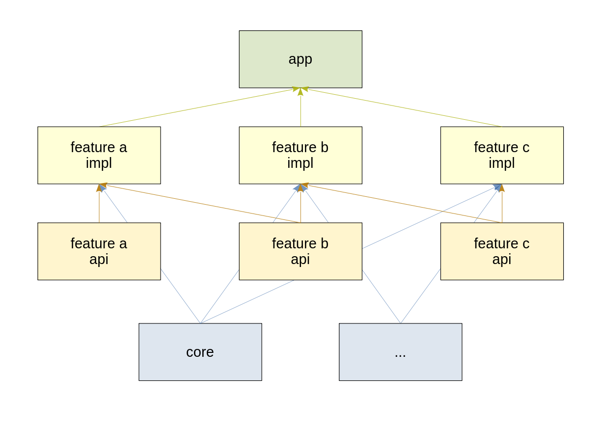

# Feature module template project

Template project for starting android development.

### Quick overview

| Feature      | Short description  |
|--------------|--------------------|
| Architecture | Feature modules    |
| DI           | Hilt               |
| UI           | Compose and MVI    |
| Navigation   | Compose navigation |

### Architecture



Feature modules, each divided into two parts: api and impl.

Api modules only contain logic for navigating to this module, and don't rely on other modules.
It's preferable to put all logic into objects with Destination suffix, such as HomeDestination.
Members naming inside the Destination object is not enforced (but can be via an interface),
however this template uses `ROUTE` constant for adding the route to the NavGraph, and
`constructRoute()` for returning a string with arguments to be used for navigating to this route.

Impl modules contain screens, implementation for the navigation, and can rely on other api modules
for navigating to them.

Naming scheme of modules and packages is camelCase (homeApi, com.package.homeImpl).

### UI

Single Activity containing bottom navigation bar and Compose screens.

UI architecture: MVVM with MVI. State is passed to UI, Events are passed to ViewModel. No Effects.

[BaseVM](core/src/main/java/com/featuremodule/core/ui/BaseVM.kt) is a base class for ViewModels.

### Navigation

Compose navigation. Routes are created with the help of api modules.

Singleton [NavManager](core/src/main/java/com/featuremodule/core/navigation/NavManager.kt) is used
to abstract navigation and move navigation command triggering to ViewModels.
Stream of navigation commands is observed in the module responsible for navigation (currently :app).

### Gradle

Version catalogs are used for version management.

Convention plugins are added in buildSrc for easier management of build.gradle files.
Main plugins are:

- [convention-linters](buildSrc/src/main/kotlin/convention-linters.gradle.kts)
  \- adds and configures detekt and ktlint plugins.
- [convention-android-library](buildSrc/src/main/kotlin/convention-android-library.gradle.kts)
  \- uses convention-linters, sets up general settings in android{} extension, which are shared
  with all android library modules. Mainly used for core and api feature modules.
- [convention-feature-module](buildSrc/src/main/kotlin/convention-feature-module.gradle.kts)
  \- uses convention-android-library, sets up additional dependencies
  (Hilt, Navigation, Compose), which are useful for all impl feature modules.

Convention plugins introduce some issues when using version catalogs in them, especially in
`plugins{}` blocks, so some workarounds were applied where possible.

In addition to Android Studio's module creation, a custom gradle task `:createLibraryModule` was
added, that automatically adds build.gradle with convention plugins to the new module. Source can be
found in [CreateAndroidModuleTask.kt](buildSrc/src/main/kotlin/CreateAndroidModuleTask.kt),
and setup in root [build.gradle.kts](build.gradle.kts).

Example, creating module 'module1' in subdirectory 'feature':

```
./gradlew createLibraryModule --name :feature:module1
```
